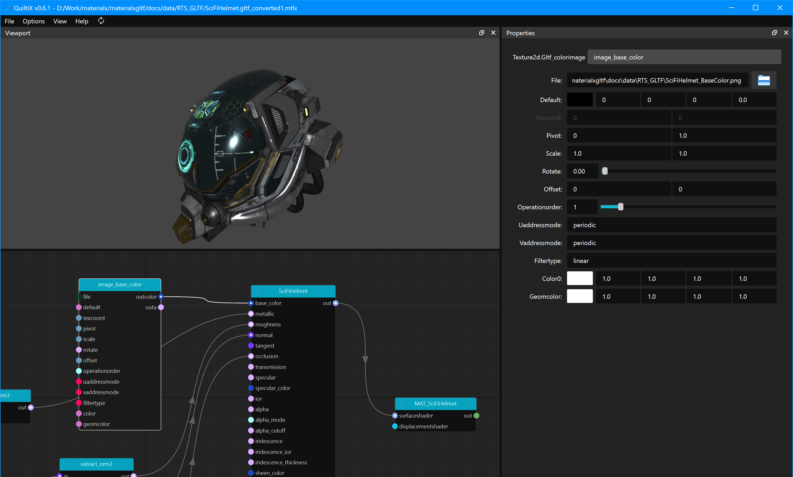
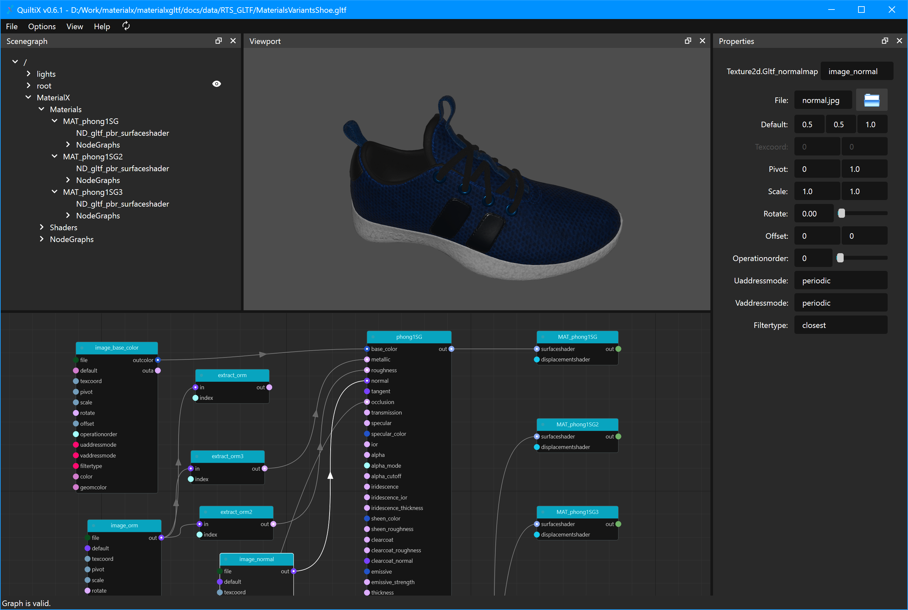
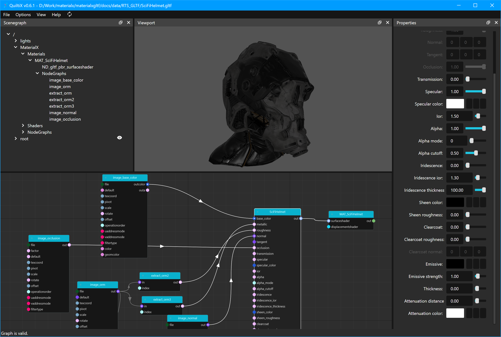

## QuiltiX glTF Plugin 

This plugin allows for serialization of node graphs to and from glTF.

The current supported MaterialX version for `QuiltiX` which is `1.38.9`. When `1.39` support is available no changes should be required.

The supported glTF version is `2.0`.

### Installation

```bash
pip install materialxgltf==1.38.9.1
```

Append path to plugin in `QUILTIX_PLUGIN_PATH` environment variable.

```bash
export QUILTIX_PLUGIN_PATH=$QUILTIX_PLUGIN_PATH:/path/to/materialxgltf
```

### API Documentation

API documentation can be found <a href="documents/html/index.html">here</a>

### Export to glTF

The following functionality is supported
- Translations of non-glTF shaders to glTF shaders
- Baking of upstream graph channels
- Creation of glb (binary) or gltf (json) files
    - glb files will embed a default geometry and textures
    - gltf files will reference external geometry and textures

Not currently supported:
- Saving of material assignments
- Saving without baking upstream graph channels

#### Examples

To be added.

### Import from glTF

The following functionality is supported:
- Import of glTF files to MaterialX
- Updating node graph from MaterialX

#### Examples

<table>
<tr>
<td>

<td>

</tr>
<tr>
<td>

<td>

</tr>
</table>

### Preview of glTF

The following functionality is supported:
- Preview of node graph as glTF text (JSON)

### glTF Viewer

This support has not be activated yet.
 